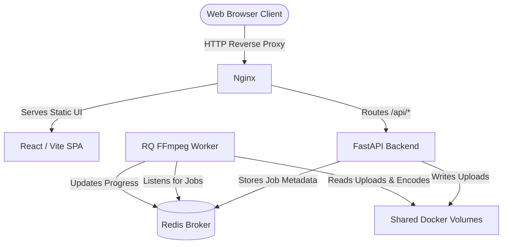
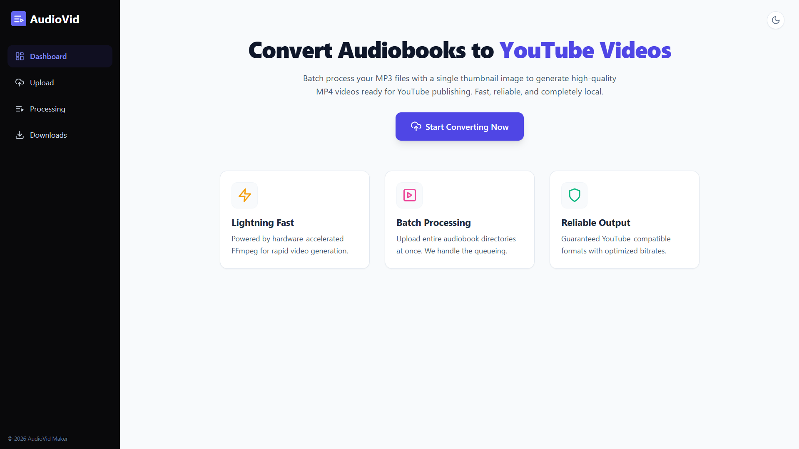
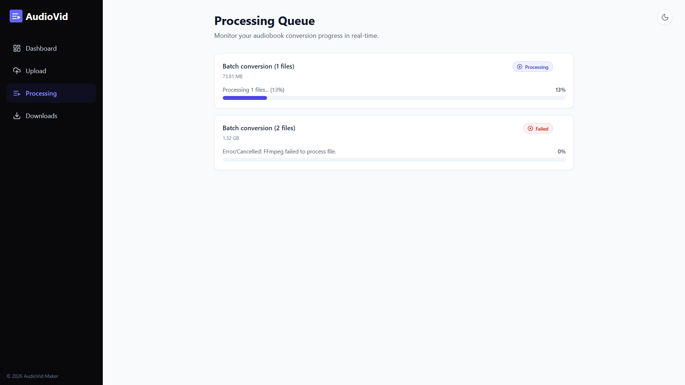
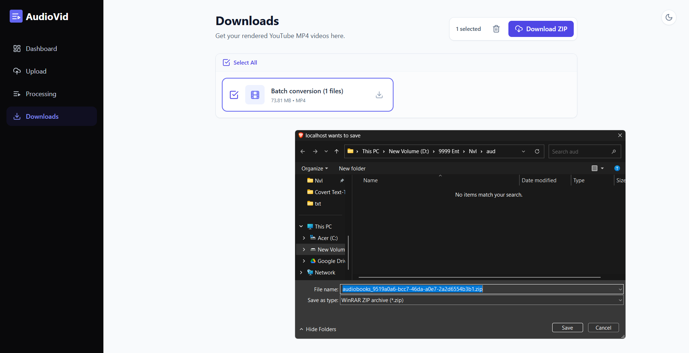
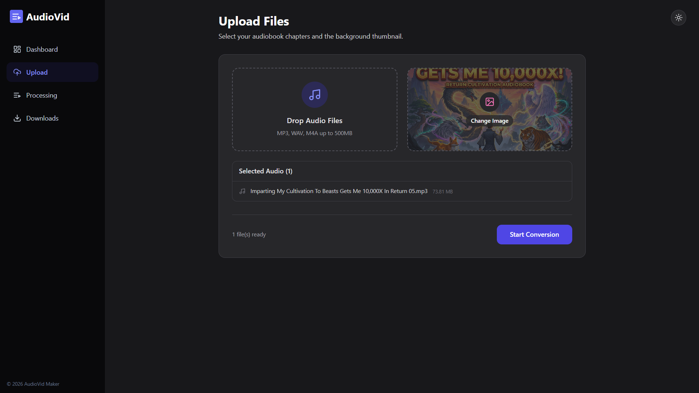

<div align="center">
  
  <h1>Audiobook Video Maker</h1>
  
  <p>
    <strong>A full-stack, production-ready pipeline to convert batch MP3 audiobooks into YouTube-ready MP4 videos.</strong>
  </p>

  <p>
    
    
    
    
    
    
  </p>
</div>

---

## 📖 Introduction

**Audiobook Video Maker** is an enterprise-grade platform designed to streamline the workflow of YouTube content creators and audiobook publishers. It takes a batch of MP3 files and a single static thumbnail, then leverages a distributed asynchronous queue to concurrently compile them into highly-optimized, YouTube-compatible MP4 videos.

Designed with scalability in mind, it utilizes Docker, a Redis-backed Task Queue (RQ), Nginx, and hardware-accelerated FFmpeg.

---

## ✨ Features

- **📂 Multi-file Uploads**: Drag and drop entire audiobook directories at once.
- **🖼️ Static Background**: Applies a single high-quality image across all rendered videos.
- **⚡ Hardware Acceleration**: Automatically detects Nvidia GPUs for ultra-fast `h264_nvenc` encoding.
- **🚦 Concurrent Processing**: Processes multiple videos in parallel using a queue-based architecture.
- **📊 Real-Time Progress**: Live polling ensures your frontend UI stays accurately synced with backend worker states.
- **📦 Batch Zipping**: Download completed renders individually, or package selected finished videos into a single ZIP file.
- **🧹 Auto-Cleanup**: Smart temporary file management and persistent storage guarantees 3-day history retention.
- **🌙 Dark Mode**: Beautifully designed Light and Dark modes with responsive UI.

---

## 🏆 Why AudioVid Stands Out

When converting long-form audiobooks into YouTube-ready videos, creators typically resort to web converters or heavy video editing software. Here is why AudioVid is the superior, purpose-built solution:

| Feature | AudioVid (This Project) | Cloud Web Converters (CloudConvert, Zamzar) | Desktop NLEs (Premiere, Resolve, Handbrake) |
| :--- | :--- | :--- | :--- |
| **File Size Limits** | ♾️ **Unlimited** (Handles 10+ hour audiobooks) | ❌ Capped at ~50MB/100MB per file | ♾️ Unlimited |
| **Processing Speed** | ⚡ **Instantaneous** (`-c:a copy` + 1 FPS rendering) | ❌ Extremely slow server queues | ❌ Very slow (Re-encodes the entire audio track) |
| **Data Privacy** | 🔒 **100% Local** (Runs securely via Docker) | ❌ Uploads your files to external servers | 🔒 100% Local |
| **Batch Processing** | ✅ **Automated Queue** (Drag & Drop directories) | ❌ Requires manual 1-by-1 uploads | ❌ Complex setup requiring timeline dragging |
| **Hardware Use** | 🧠 **Smart** (Limits CPU threads, detects GPU) | N/A | ❌ Heavy resource utilization |
| **Pricing** | 💸 **100% Free & Open Source** | ❌ Monthly subscription for large files | ❌ Extremely expensive licenses (Premiere Pro) |

---

## 🏗️ Architecture Overview

The application follows a modern microservice architecture completely orchestrated via Docker Compose.



---

## 🛠️ Tech Stack

### Frontend
- **React.js 18** + **Vite**
- **Tailwind CSS** (Styling & Dark Mode)
- **Zustand** (State Management & Storage Persistence)
- **React Dropzone** (Drag & Drop UI)
- **Axios** & **React Router**

### Backend
- **Python 3.11** + **FastAPI**
- **RQ (Redis Queue)** (Task Broker)
- **FFmpeg** (Video Transcoding)
- **Uvicorn** (ASGI Server)

### Infrastructure
- **Docker & Docker Compose**
- **Nginx** (Reverse Proxy & Static File Serving)
- **Redis 7** (Message Queue)

---

## 📸 Screenshots


| Dashboard / Upload | Processing Queue |
| :---: | :---: |
|  |  |

| Downloads Page | Dark Mode Design |
| :---: | :---: |
|  |  |

---

## 🚀 Installation & Docker Setup

The easiest and most reliable way to run this application is via Docker Compose.

### Prerequisites
- [Docker Engine](https://docs.docker.com/engine/install/) & [Docker Compose](https://docs.docker.com/compose/install/)
- *(Optional)* [Nvidia Container Toolkit](https://docs.nvidia.com/datacenter/cloud-native/container-toolkit/latest/install-guide.html) (For GPU-Accelerated rendering)

### Steps

1. **Clone the repository**
   ```bash
   git clone https://github.com/predXpramad/AudioVid.git
   cd AudioVid
   ```

2. **Configure Environment Variables**
   ```bash
   cp .env.example .env
   # Edit .env with your specific configurations
   ```

3. **Build and Start the Containers**
   ```bash
   docker-compose up --build -d
   ```

4. **Access the Application**
   Open your browser and navigate to `http://localhost`.

---

## 💻 Local Development Setup

If you wish to run the services outside of Docker for development/debugging:

1. **Start Redis Server**: Ensure you have Redis running locally on port `6379`.
2. **Backend**:
   ```bash
   cd backend
   python -m venv venv
   source venv/bin/activate  # On Windows: venv\Scripts\activate
   pip install -r requirements.txt
   uvicorn app.main:app --reload --port 8000
   ```
3. **Worker**:
   ```bash
   cd worker
   pip install -r requirements.txt
   python run_worker.py
   ```
4. **Frontend**:
   ```bash
   cd frontend
   npm install
   npm run dev
   ```

---

## ⚙️ Environment Variables

Create a `.env` file in the root directory. Use `.env.example` as a template.

```env
# Backend Configuration
PORT=8000
API_V1_STR=/api/v1
CORS_ORIGINS=["http://localhost", "http://localhost:5173"]

# Redis Config
REDIS_URL=redis://redis:6379/0

# Worker Config
MAX_CONCURRENT_JOBS=3
```

---

## 🔌 API Endpoints

The FastAPI backend provides comprehensive REST endpoints. Interactive Swagger documentation is available at `http://localhost/api/docs` when the app is running.

| Method | Endpoint | Description |
| :--- | :--- | :--- |
| `POST` | `/api/v1/convert/` | Upload audio and image files to initiate jobs |
| `GET` | `/api/v1/convert/status/{job_id}` | Poll for current FFmpeg conversion progress |
| `DELETE`| `/api/v1/convert/cancel/{job_id}` | Safely abort an active encoding worker |
| `GET` | `/api/v1/download/{job_id}` | Download a completed MP4 file |
| `POST` | `/api/v1/download/batch-zip` | Request a single ZIP containing multiple MP4s |

---

## 📂 Project Folder Structure

```text
├── backend/                  # FastAPI Application
│   ├── app/
│   │   ├── api/routes/       # Endpoints (convert.py, download.py)
│   │   ├── core/             # Config, Constants
│   │   ├── services/         # Redis queue dispatchers
│   └── main.py               # Uvicorn entrypoint
├── frontend/                 # React UI
│   ├── src/
│   │   ├── components/       # Reusable UI parts
│   │   ├── pages/            # View logic
│   │   ├── store/            # Zustand global state
│   └── nginx.conf            # Custom Nginx SPA routing
├── worker/                   # Async Task Processor
│   ├── tasks/                # FFmpeg subprocessing wrapper
│   └── utils/                # Progress extraction regex
├── nginx/                    # Root Reverse Proxy
│   └── nginx.conf
└── docker-compose.yml        # Orchestration
```

---

## 🎥 How Conversion Works

This platform handles long-form audiobook conversions safely without overloading system resources:
1. **Validation**: API validates inputs and securely saves files to a shared Docker Volume.
2. **Queueing**: The API dispatches jobs to Redis RQ.
3. **Hardware Fallback Check**: The python worker probes the container using `nvidia-smi` and a lightweight FFmpeg test. If Nvidia is present, `h264_nvenc` + `-preset p1` is selected. Otherwise, it gracefully falls back to `libx264`.
4. **Transcoding**: The audio is copied natively (`-c:a copy` or `aac`) while the static image loops at `-framerate 1`.
5. **Progress Polling**: FFmpeg `stderr` is parsed line-by-line via Regex. It compares the current processed timestamp against `ffprobe` total duration, emitting `%` updates back to Redis.

---

## 📈 Scaling Workers

Need to process 100 audiobooks rapidly? You can easily scale the worker nodes to process more items concurrently via Docker Compose:

```bash
docker-compose up --build --scale worker=3 -d
```
*Note: Monitor your CPU/GPU utilization to avoid bottlenecks when scaling.*

---

## 🌍 Deployment Guide

To deploy this application to a production VPS (DigitalOcean, AWS, Linode):

1. Clone the repository on your remote server.
2. Modify `docker-compose.yml` to remove Nvidia resource bindings if your cloud instance doesn't have a GPU.
3. Update `CORS_ORIGINS` in `.env` to include your production domain name.
4. Modify `nginx/nginx.conf` to include valid SSL certificates (e.g., using Certbot/Let's Encrypt).
5. Run `docker-compose up --build -d`.

---

## 🐛 Troubleshooting

- **`404 Not Found` on Refreshing Pages**: Ensure the custom `frontend/nginx.conf` is building correctly in your image. The `try_files` directive resolves SPA routing.
- **Containers Exiting (Code 137)**: Docker is running out of RAM. Ensure Docker Desktop has at least 4GB of RAM allocated.
- **FFmpeg Error - Invalid Argument**: MP4 containers do not support `WAV` (PCM) audio well. The worker attempts to transcode `WAV` to `AAC`, but ensure your source files aren't corrupted.

---

## 🔮 Future Improvements

- [ ] Implement WebSocket support for real-time progress instead of HTTP polling.
- [ ] Add an Admin Dashboard for historical metrics and error tracking.
- [ ] Support metadata tagging (ID3 to MP4 Title/Artist mapping).
- [ ] Implement Google Cloud Storage or S3 for output persistence.

---

## 🤝 Contributing

Contributions, issues, and feature requests are welcome!

1. Fork the Project
2. Create your Feature Branch (`git checkout -b feature/AmazingFeature`)
3. Commit your Changes (`git commit -m 'Add some AmazingFeature'`)
4. Push to the Branch (`git push origin feature/AmazingFeature`)
5. Open a Pull Request

---

## 📄 License

Distributed under the MIT License. See `LICENSE` for more information.
